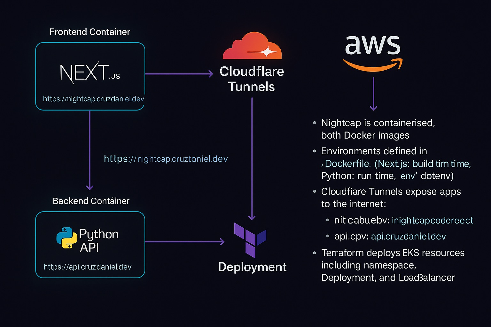

# Nightcap.ai
[](https://deepwiki.com/DDC-96/nightcap-ai)

Nightcap.ai is a modern, AI-powered web application for cocktail enthusiasts. It provides a curated collection of cocktail recipes and leverages the OpenAI API to generate unique, new cocktail ideas based on user prompts. The application is fully containerized with a Next.js frontend and a FastAPI backend.



## Features

*   **AI Cocktail Generator**: Input a flavor profile, an ingredient, or a mood, and receive a completely new cocktail recipe generated by AI.
*   **Curated Recipe Library**: Browse a hand-picked list of classic and modern cocktails, complete with stunning images, rich descriptions, ingredients, and instructions.
*   **Detailed Recipe Pages**: Every cocktail has its own dedicated page with a long-form description, precise ingredient measurements, and clear preparation steps.
*   **Dark Mode First**: A sleek, moody aesthetic is the default, providing a pleasant viewing experience.
*   **Fully Containerized**: The entire stack, including the frontend and backend, is containerized using Docker for consistent, reproducible deployments.
*   **Responsive Design**: The UI is built to be fully responsive, looking great on both desktop and mobile devices.

## Technology Stack

*   **Frontend**: Next.js 14 (App Router), React, TypeScript, Tailwind CSS, Framer Motion
*   **Backend**: FastAPI, Python 3.11
*   **AI**: OpenAI API (`gpt-3.5-turbo`) for cocktail generation
*   **Containerization**: Docker with multi-stage, multi-platform builds
*   **CI/CD**: GitHub Actions for automated Docker image builds and pushes to Docker Hub
*   **Infrastructure (Planned)**: AWS Kubernetes provisioned with Terraform

## Project Structure

The repository is organized into distinct service directories:

*   `backend/`: Contains the Python FastAPI application that serves the cocktail data and communicates with the OpenAI API.
*   `frontend/nightcap-ui/`: Houses the Next.js frontend application, including all UI components, pages, and styling.
*   `.github/workflows/`: Defines the CI/CD pipeline for building and publishing Docker images.
*   `aws-infra/`: A placeholder for future Terraform configurations to provision cloud infrastructure.
*   `docker-deploy.sh`: A shell script to automate the local deployment of the application using Docker.

## Deployment

The application is designed to be deployed using Docker. A utility script is provided to simplify स्थानीय setups.

### Prerequisites

*   Docker installed and running.
*   A `.env` file in the `./backend/` directory with your `OPENAI_API_KEY` and `CORS_ORIGIN`.
    ```bash
    # ./backend/.env
    OPENAI_API_KEY="sk-..."
    CORS_ORIGIN="http://localhost:3000"
    ```
*   A `.env.production` file in the `./frontend/nightcap-ui/` directory.
    ```bash
    # ./frontend/nightcap-ui/.env.production
    NEXT_PUBLIC_API_BASE_URL="http://localhost:8000"
    ```

### Local Deployment Script

The `docker-deploy.sh` script automates the process of running the application locally. It pulls the latest pre-built images from Docker Hub and starts the containers.

```bash
./docker-deploy.sh
```

This will:
1.  Pull the latest `nightcap-backend` and `nightcap-frontend` images from Docker Hub.
2.  Start the backend container, exposing it on port `8000`.
3.  Start the frontend container, exposing it on port `3000`.

The application will be accessible at `http://localhost:3000`.

## API Endpoints

The backend is served by a FastAPI application with the following endpoints:

| Method | Endpoint                    | Description                                     |
| :----- | :-------------------------- | :---------------------------------------------- |
| `GET`  | `/api/cocktails`              | Retrieves the full list of cocktail recipes.    |
| `GET`  | `/api/cocktails/{slug}`       | Retrieves a single cocktail by its unique slug. |
| `POST` | `/api/generate-cocktail`      | Accepts a JSON payload `{ "prompt": "..." }` and returns an AI-generated cocktail recipe. |

## CI/CD Pipeline

The repository includes a GitHub Actions workflow defined in `.github/workflows/dokcer-build-push.yml`.

This pipeline is triggered manually (`workflow_dispatch`) and performs the following actions:
1.  **Logs into Docker Hub**: Authenticates using secrets.
2.  **Injects Secrets**: Creates `.env` files for both the backend and frontend using GitHub secrets.
3.  **Builds & Pushes Images**: Builds multi-platform (`linux/amd64`, `linux/arm64`) Docker images for both the frontend and backend.
4.  **Caches Layers**: Uses GitHub's cache to speed up subsequent builds.
5.  **Tags and Pushes**: Tags the images as `latest` and pushes them to the configured Docker Hub repository.
